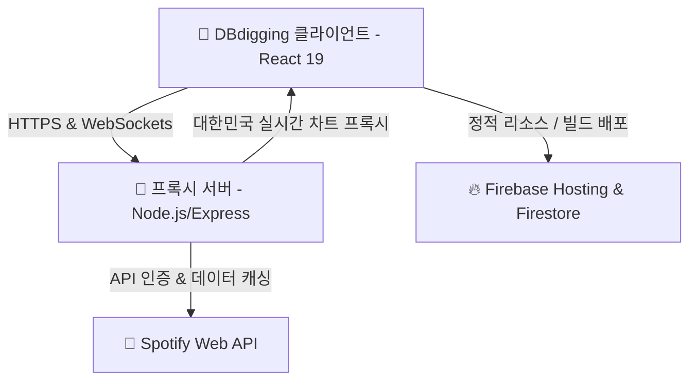

# 🌌 DBdigging (디비디깅)

> **우주선에서 항해하는 은하계 음악 디깅 플랫폼**
> 
> DBdigging은 음악 장르와 오디오 특성 데이터를 우주 속 별자리와 성도(Constellation)로 시각화하여, 마치 탐사선 조종석에서 새로운 은하계를 개척하듯 음악을 탐색하고 감상할 수 있는 **Premium Space Cockpit HUD 테마의 음악 디깅 서비스**입니다.

---

## 🚀 서비스 개요 및 컨셉

### 🛸 Space Cockpit HUD & Immersive Transition
* **우주선 진입 효과**: 첫 화면에서 '장르별 음악 탐색 시작' 버튼을 누르는 순간, 화면이 급속도로 확대되며 광활한 우주공간에서 최첨단 우주선 브릿지(Bridge) 내부로 쑤욱 미끄러져 들어가는 몰입감 넘치는 카메라 트랜지션을 제공합니다.
* **유리창 너머의 우주**: 탐사 대시보드 뒷배경은 반투명 글래스모피즘(Glassmorphism, `rgba(0, 0, 0, 0.4)`, `backdrop-blur-[12px]`) 처리를 적용하여, 전면 유리를 통해 끝없는 우주 성운(Nebula)을 바라보는 듯한 미래지향적 공학 감성을 연출합니다.

---

## ✨ 핵심 기능 (Core Features)

### 1. 🌌 성도 탐사 성계 (Constellation Network Explorer)
* **D3-force 물리 엔진 기반**: 음악 장르, 세부 장르, 개별 곡들을 물리적으로 연결된 거대한 성도 네트워크 그래프로 시각화합니다.
* **실시간 상호작용**: 별자리 노드를 클릭하면 해당 영역으로 우주선 카메라가 궤도를 트래킹하듯 좌표를 이동하며, 콕핏 미니맵(Minimap) 및 레벨 트랙이 동기화됩니다.

### 2. 📊 오디오 특성 콕핏 레이더 차트 (Cockpit Radar Chart)
* **6가지 핵심 지표 가시화**: D3/SVG 기반 맞춤 레이더 차트를 통해 음원의 6대 사운드 특징을 입체적으로 투사합니다.
  * **Acoustic (어쿠스틱 감도)** / **Dance (댄스 적합도)** / **Energy (에너지 강도)**
  * **Instrument (음성 부재율)** / **Speech (발화 밀도)** / **Valence (음악적 밝기)**
* **장르 평균 대비 곡 비교**: 현재 탐색 중인 장르의 평균 지표(보라색)와 개별 선택곡의 지표(네온 그린)를 이중 오버레이하여 곡의 음악적 성향을 직관적으로 비교 분석합니다.

### 3. 💬 스마트 경계 인지형 한국어 설명 툴팁 (Smart Boundary-Aware Tooltip)
* **화면 잘림 방지 (Anti-Clipping)**: 우측 패널의 `overflow-hidden` 경계 안에서 설명 박스가 잘리는 문제를 막기 위해 **수평 한계 고정(Clamping)** 알고리즘을 도입했습니다.
* **동적 꼬리 조준 (Dynamic Arrow Offset)**: 툴팁 상자가 테두리를 피해 움직이더라도, 말풍선 꼬리(Arrow)는 오프셋 픽셀 보정(`calc(50% + Δpx)`)을 통해 원래 가리키던 텍스트 정중앙을 정확하게 조준합니다.
* **수직 자동 플리핑 (Smart Flipping)**: 최상단 레이블을 호버할 경우 툴팁이 자동으로 타겟 **아래 방향**으로 반전 렌더링되며 화살표 꼬리 방향 또한 상단으로 자동 전환됩니다.
* **모바일 더블 탭 버그 방어**: 모바일 터치 장치에서 `onTouchStart`와 `onClick`이 중복 발화되어 툴팁이 켜지자마자 꺼지는 오작동 현상을 완벽히 차단했습니다.

### 4. 📱 모바일 가로모드 강제 유도 시스템 (Landscape Orientation Guide)
* **전용 안내 컴포넌트 (`<LandscapeGuide>`)**: 본 서비스는 고품격 3단 와이드 레이아웃 및 콕핏 HUD 뷰로 이루어져 세로 화면에 부적합합니다.
* 세로 모드로 진입 시 메인 앱 렌더링을 일시 차단하고, 우주 배경 위에 스마트폰을 가로로 회전하도록 유도하는 네온 글래스모픽 안내 화면을 띄워 최고의 사용자 경험을 이끌어냅니다.

---

## 🛠️ 기술 스택 (Tech Stack)

### Frontend
* **Core**: `React 19` + `TypeScript` + `Vite`
* **Styling**: `Tailwind CSS v4` (Modern SF Cockpit Theme)
* **Animation & Transitions**: `Motion` (Framer-Motion)
* **Visualization & Interaction**: `D3-force` 물리 엔진, `react-force-graph-2d`, `Recharts`

### Backend
* **Runtime**: `Node.js` + `Express`
* **Spotify Integration**: Spotify Web API 클라이언트 크리덴셜 연동
* **Caching & Rate Limit Protection**: 트랙/아티스트 정보 인메모리 캐싱 프록시, 실시간 대한민국 인기 차트(Top 50) 캐싱 및 API 429 과부하 대피 방어선 설계

### Database & Deployment
* **Platform**: `Firebase (Hosting & Firestore)`

---

## 🌐 시스템 아키텍처 및 데이터 흐름



---

## 📂 프로젝트 폴더 구조

```text
DBdigging/
├── .firebase/            # Firebase 설정 캐시
├── dist/                 # Vite 빌드 아웃풋 (배포 파일)
├── server.js             # Express 기반 Spotify 프록시 & 캐싱 서버
├── check_db.js           # Firestore 및 DB 정합성 검사 유틸리티
├── package.json          # 의존성 패키지 및 구동 스크립트
├── firestore.rules       # Firestore 보안 규칙
├── tsconfig.json         # TypeScript 환경설정
└── src/                  # 프론트엔드 소스 코드
    ├── main.tsx          # 애플리케이션 시작점
    ├── App.tsx           # 메인 레이아웃 및 우주선 트랜지션 로직
    ├── index.css         # 글로벌 스타일 및 콕핏 네온/유리창 효과 선언
    ├── types.ts          # 전체 데이터 인터페이스 (AudioFeatures, Track 등)
    ├── DiggingContext.tsx# 디깅 상태 전역 컨텍스트
    ├── components/       # 핵심 UI 및 HUD 컴포넌트 폴더
    │   ├── GlassPanel.tsx             # 맥 스타일 헤더 바 데코 및 글래스모픽 컨테이너
    │   ├── CockpitRadarChart.tsx      # SVG dynamic 6축 음향 특징 지표 레이더 차트
    │   ├── RightPanel.tsx             # 우측 분석 패널 & 스마트 반전 설명 툴팁
    │   ├── LeftPanel.tsx              # 좌측 네비게이션 트리 (장르/곡 선택)
    │   ├── Constellation.tsx          # 중앙 성계 인터랙티브 은하 지도
    │   ├── Minimap.tsx                # 현재 별자리 좌표 추적 모듈
    │   ├── TelescopeDrawer.tsx        # 은하 탐사선 전용 망원경(Telescope) 드로어
    │   ├── LandscapeGuide.tsx         # 모바일 회전 권장 풀스크린 오버레이
    │   ├── SearchDropdown.tsx         # 네온 HUD 스타일 실시간 검색 바
    │   ├── SpotifyPlayer.tsx          # Spotify 플레이어 연계 컴포넌트
    │   └── PlaylistModal.tsx          # 임베드 플레이어 모달 팝업
    └── lib/              # 공용 유틸리티 및 라이브러리 모음
```

---

## ⚙️ 실행 및 배포 가이드 (Getting Started)

### 1. 환경 설정 파일 (`.env`) 세팅
프로젝트 루트 디렉토리에 `.env` 파일을 생성하고 아래 환경 변수를 기입합니다.
```env
# Spotify API 크리덴셜
SPOTIFY_CLIENT_ID=your_spotify_client_id_here
SPOTIFY_CLIENT_SECRET=your_spotify_client_secret_here

# Spotify 인기 차트 수집용 플레이리스트 타겟 (대한민국 Top 50 플레이리스트 링크/ID)
SPOTIFY_PLAYLIST_URL=https://open.spotify.com/playlist/3i51Pj9TZKrH2waJP8NRM5
```

### 2. 패키지 설치 및 로컬 서버 동시 실행
Express 백엔드 서버와 Vite 프론트엔드 개발 서버를 동시에 구동하기 위해 `concurrently` 스크립트를 적용해 두었습니다.
```bash
# 1) 의존성 라이브러리 설치
npm install

# 2) 로컬 개발 서버 동시 기동 (Express: Port 10000 / Vite: Port 3000)
npm run dev
```

### 3. 프로덕션 빌드 및 배포
Vite 빌드 후 Firebase CLI를 통해 정적 리소스를 호스팅 서버에 배포합니다.
```bash
# 1) TypeScript 타입 검사 및 배포 번들 빌드
npm run build

# 2) Firebase Hosting 배포
firebase deploy --only hosting
```